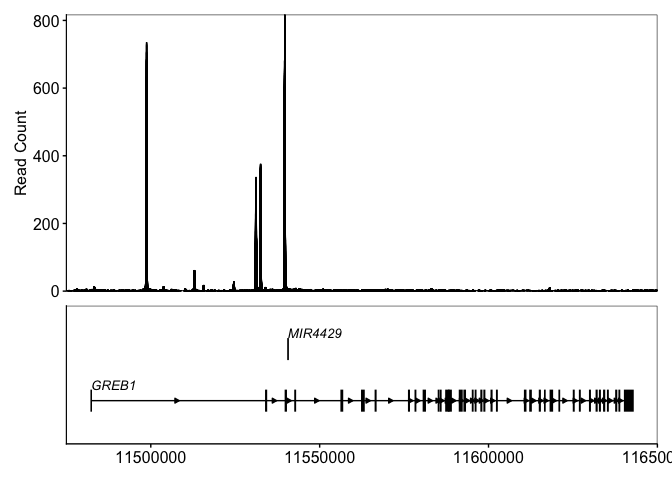
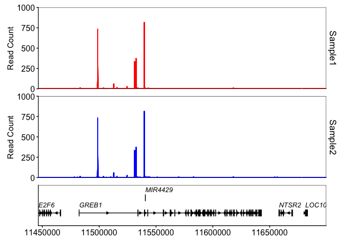
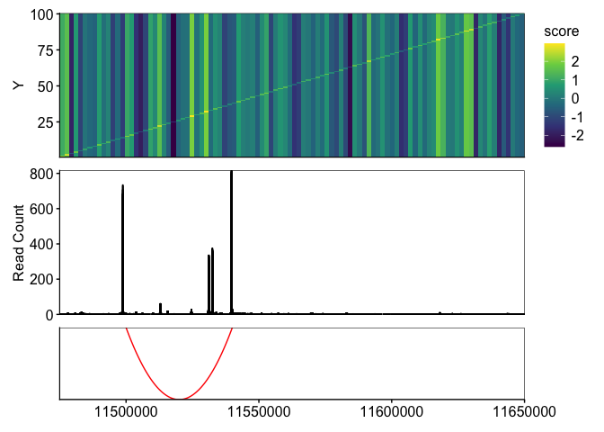

<!-- README.md is generated from README.Rmd. Please edit that file -->

# Rgenometracks

<!-- badges: start -->

<!-- badges: end -->

Rgenometrack provides a simple interface for plotting genome tracks using ggplot.

## Installation

You can install the development version of Rgenometracks like so:

``` r
# Install BiocManager if not already installed
if (!requireNamespace("BiocManager", quietly = TRUE)) {
    install.packages("BiocManager")
}

# Install the package directly from GitHub
BiocManager::install("GKBlomquist/Rgenometracks")
```

## Example

### Single-sample BigWig plot

Plotting a single bigwig track with genes. I recommend using `patchwork` to combine multiple tracks into a single plot. This allows for more advanced options like combining axes and setting individual heights for each track plot.

``` r
library(Rgenometracks)
library(tidyverse)
library(patchwork)
library(org.Hs.eg.db)
library(TxDb.Hsapiens.UCSC.hg38.knownGene)

# set unified theme
set_theme_modern()

# set region and reference genome
bw_file = "~/Downloads/ESR1.bigWig"
region <- "chr2:11475000-11650000"
txdb <- TxDb.Hsapiens.UCSC.hg38.knownGene # remember to grab the correct TxDb amd orgdb for your reference genome
orgdb <- org.Hs.eg.db

# plot BigWig track
bigwig_track(file = bw_file, region) +

# plot genes in region
genes_track(region, 
            txdb = txdb, orgdb = orgdb, 
            collapse = TRUE, fully_in_view = TRUE) +
  
plot_layout(ncol = 1, axes = "collect_x", heights = c(1, 0.5))
```



### Multi-sample BigWig plot

Rgenometracks enables plotting multiple bigwig files in one plot through the `multi_bigwig_track` function. The function takes a named list of BigWig paths, were the list names will be used to label each bigwig plot.

``` r
sample1_path = "~/Downloads/ESR1.bigWig"
sample2_path = "~/Downloads/ESR1.bigWig"

sample_list = list(
  "sample 1" = sample1_path,
  "sample 2" = sample2_path
)

multi_bigwig_track(sample_list, region, colors = ggsci::pal_npg()) +
genes_track(region, 
            txdb = txdb, orgdb = orgdb, 
            collapse = TRUE, fully_in_view = TRUE) +
  
plot_layout(ncol = 1, axes = "collect_x", heights = c(4, 1)) 
```



### Additional features

Rgenometracks offers additional features like plotting arcs with `arcs_track` and plotting deep learning model contribution scores using `bigwig_logo_track`. Moreover, since Rgenometrack functions return ggplot2 objects, any ggplot2 plot can easily be added with a genome track, providing endless flexibility.

``` r

heatmap_data <- data.frame(diag(100) + rnorm(100)) %>% 
  rownames_to_column("X") %>% 
  pivot_longer(-X, names_to = "Y", values_to = "score") %>% 
  mutate(X = as.integer(X), Y = as.integer(gsub("X", "", Y)))

heatmap <- ggplot(heatmap_data, aes(x = X, y = Y, fill = score))+
  geom_tile() +
  scale_x_continuous(expand = c(0,0), name = NULL, breaks = NULL) +
  scale_y_continuous(expand = c(0,0)) +
  scale_fill_viridis_c()

heatmap +
  bigwig_track(file = bw_file, region) +
  arcs_track(data.frame("chr2", 11500000, 11540000, 2), region, arc_color = "red") +
  
  plot_layout(ncol = 1, heights = c(1,1,0.5), axes = "collect_x")
#> Warning in qt((1 - level)/2, df): NaNs produced
#> Warning in max(ids, na.rm = TRUE): no non-missing arguments to max; returning
#> -Inf
```



## Full list of available tracks:

1.  BigWig track (e.g., ChIP-seq or ATAC-seq signals): `bigwig_track`, `multi_bigwig_track`
2.  logo track (e.g., deeplearning model contribution scores): `bigwig_logo_track`
3.  Arcs track (e.g. ABC connections): `arcs_track`
4.  BED track (e.g., binding sites): `bed_track`
5.  genes track: `genes_track`
